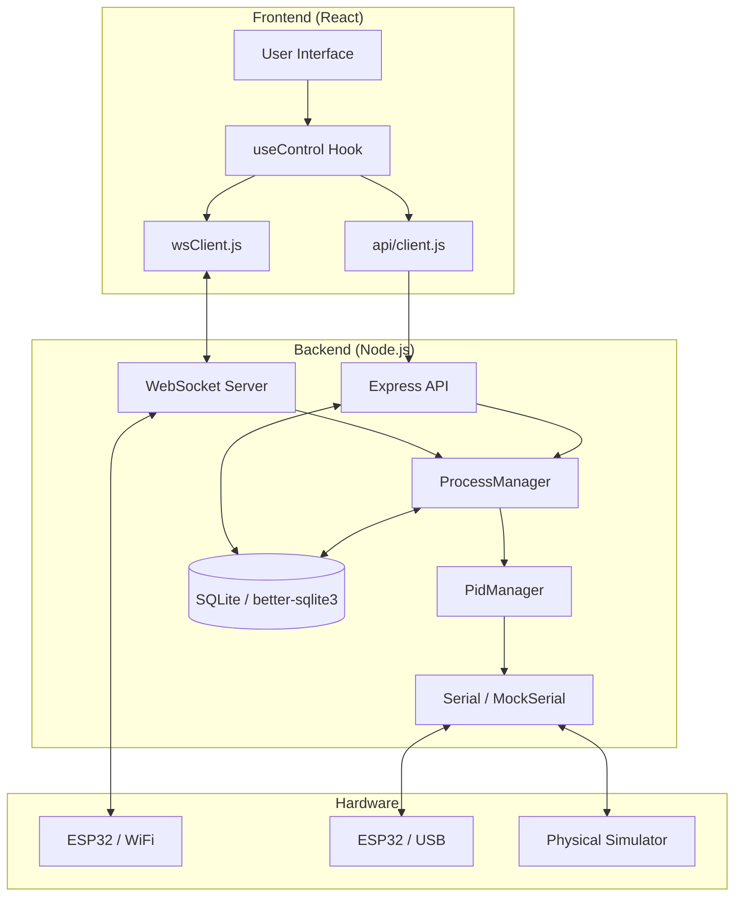

# 🍺 OrangeBrew: Documentation Lite

**OrangeBrew** — это высокотехнологичная система для автоматизации пивоварения и дистилляции. Документация описывает архитектуру V7 с поддержкой многопользовательского режима, PID-контроля и интеграции с ESP32.

---

## 🏗 Общая архитектура (System Overview)

Система построена по принципу разделения на **Control Plane** (Backend logic) и **View Plane** (React UI).

---

## 📡 Потоки данных (Data Flows)

### 1. Телеметрия (Telemetry: Hardware ➔ UI)
Данные от датчиков обновляются в реальном времени (Real-time).

1.  **Hardware**: ESP32 отправляет JSON пакет `{ type: 'sensors_raw', sensors: [...] }`.
2.  **Backend**: `liveServer.js` принимает данные по WebSocket (WiFi) или Serial (USB).
3.  **Mapping**: `server.js` (`mapSensors`) преобразует адреса датчиков в роли (`boiler`, `column`).
4.  **Distribution**:
    - Запись в `temperature_log` (каждые 10 сек).
    - Передача в `PidManager` для расчета мощности ТЭНа.
    - Передача в `ProcessManager` для проверки завершения шага (нагрев завершен?).
    - **Broadcast**: WebSocket рассылка всем frontend-клиентам.
5.  **Frontend**: `wsClient.js` получает сообщение, обновляет стейт через хук `useControl`, графики Recharts перерисовываются.

### 2. Управление (Control: UI ➔ Hardware)

1.  **Direct Control**: Пользователь меняет мощность в UI -> REST POST `/api/control/heater` -> `controlRouter` -> Вызов `sendToUserHardware` -> ESP32 получает команду.
2.  **Automated Control**: `ProcessManager` решает сменить шаг -> `PidManager.setTarget()` -> Вычисление PID -> Вызов `setHeaterState()` -> `controlRouter` -> ESP32.

---

## 🛠 Ключевые модули Backend (Senior View)

### 1. ProcessManager (services/ProcessManager.js)
"Сердце" процесса. Управляет переходом между стадиями (Затирание, Варка).
- **Логика**: Работает как конечный автомат (FSM). Состояния: `IDLE`, `HEATING`, `HOLDING`, `PAUSED`.
- **Функция `handleSensorData`**: Сравнивает текущую температуру с целевой. При достижении переключает `stepPhase` с `heating` на `holding` и запускает таймер.
- **Интеграция**: Вызывает `PidManager` для поддержания температуры и `telegram` для уведомлений.

### 2. PidManager (pid/PidManager.js)
Регулятор мощности нагрева.
- **Алгоритм**: Классический PID (пропорционально-интегрально-дифференциальный).
- **Фильтрация**: Использует `KalmanFilter` для подавления шумов датчиков, что предотвращает "дерганье" ТЭНа.
- **Auto-tuning**: Встроенный `PidTuner` позволяет автоматически подобрать коэффициенты Kp, Ki, Kd методом релейных колебаний.

### 3. Database Layer (db/database.js)
- **Engine**: `better-sqlite3`.
- **Особенности**: Поддержка многопользовательской среды (Multitenancy) через `user_id`. Использует WAL-mode для высокой скорости записи логов температур без блокировки чтения.

---

## 💻 Ключевые модули Frontend

### 1. useControl Hook (hooks/useControl.js)
Центральный хаб управления состоянием оборудования.
- **Sync**: Подписывается на WS `control` сообщения для отображения актуального состояния (даже если управление идет от ProcessManager или другого устройства).
- **Retry**: Автоматически переподключается при обрыве связи.

### 2. API Client & WS Client
- **Auth**: JWT токен передается в заголовках REST и как query-param в WebSocket.
- **wsClient**: Реализует очередь команд (`commandQueue`) — если отправить команду в момент дисконнекта, она уйдет сразу после восстановления связи.

---

## 👥 Многопользовательская изоляция

Каждый пользователь (`userId`) имеет:
1.  Свой экземпляр `ProcessManager`.
2.  Свой экземпляр `PidManager`.
3.  Свои настройки датчиков и коэффициенты PID в БД.
4.  Привязанные устройства (`api_key` аутентификация для ESP32).

---

## 📂 Структура файлов

- `/backend/server.js` — Инициализация, DI, роутинг.
- `/backend/pid/` — Математика управления.
- `/backend/ws/liveServer.js` — Реалтайм транспорт.
- `/frontend/src/api/` — Взаимодействие с сервером.
- `/frontend/src/pages/` — Процессные страницы (Mashing, Boiling и др.).

---

## 🎨 Image Generation Prompts (for Banana/Midjourney/DALL-E)

Для визуализации архитектуры вставьте следующие промпты в генератор изображений:

1.  **System Architecture Visualization (Isometric):**
    > High-tech isometric 3D infographic of a brewery automation system named "OrangeBrew". On the left: a sleek React Web UI on a tablet showing temperature charts. In the center: a glowing digital brain icon representing a Node.js backend with PID loops. On the right: an ESP32 microcontroller connected to stainless steel brewing tanks with sensors. Use a color palette of deep orange, charcoal gray, and electric blue. Futuristic, professional, 8k resolution, clean lines.

2.  **PID Control Loop Flow:**
    > Abstract digital art representing a PID control feedback loop for heating. A wave of sensor data (particles) flows into a Kalman Filter (crystalline structure), then into a PID controller (mathematical glowing sphere) which outputs a power beam to a heating element. Cyberpunk aesthetic, technical, glowing data paths, orange and teal lighting.

3.  **Software Module Interaction Map:**
    > Professional software architecture diagram concept art. Floating semi-transparent glass panes representing modules: "Process Manager", "PID Controller", "SQLite Database", and "WebSocket Server". Interconnecting glowing light pipes showing data flow. Modern UI/UX style, blurred background, high complexity, sharp focus.

---
*Документация подготовлена в роли Senior Developer. Не изменяйте код проекта, все изменения вносятся только в этот файл.*
